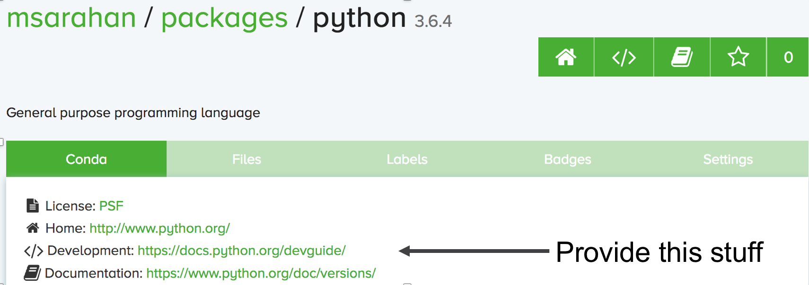

.. _conda_build:

##############
Conda Packages
##############

Building Conda Packages
=======================

A package system for anything...

Wheels vs. Conda packages
-------------------------

+-------------------------------------+-------------------------------------+
|  Wheels                             |    Conda packages                   |
+=====================================+=====================================+
| Employed by pip, blessed by PyPA    |  Foundation of Anaconda ecosystem   |
+-------------------------------------+-------------------------------------+
| Used by any python installation     |  Used by conda python installations |
+-------------------------------------+-------------------------------------+
| Mostly specific to Python ecosystem |  General purpose (any ecosystem)    |
+-------------------------------------+-------------------------------------+
| Good mechanism for specifying range |  Primitive support for multiple     |
| of python compatibility             |  python versions (noarch)           |
+-------------------------------------+-------------------------------------+
| Depends on static linking or other  | Can bundle core system-level shared |
| system package managers to provide  | libraries as packages, and resolve  |
| core libraries                      | dependencies                        |
+-------------------------------------+-------------------------------------+

Introducing conda-build
-----------------------

* Orchestrates environment creation, activation, and build/test processes

* Can build conda packages and/or wheels

* Separate project from conda, but very tightly integrated

* Open-source, actively developed:

  https://github.com/conda/conda-build

Excercise: let’s use ``conda-build``
------------------------------------

.. code-block:: bash

	conda install conda-build

* Windows only:

.. code-block:: bash

  conda install m2-patch posix

* All platforms:

.. code-block:: bash

  cd python-packaging-tutorial/conda_build_recipes
  conda build 01_minimum

What happened?
--------------

* Templates filled in, recipe interpreted

* Build environment created (isolated)

* Build script run

* New files in build environment bundled into package

* Test environment created (isolated)

* Tests run on new package

* cleanup

Obtaining recipes
------------------

* Existing recipes (best)

   - https://github.com/AnacondaRecipes

   - https://github.com/conda-forge

* Skeletons from other repositories
  (PyPI, CRAN, CPAN, RPM)

* DIY

Anaconda Recipes
----------------

* https://github.com/AnacondaRecipes

* Official recipes that Anaconda uses for building packages

* Since Anaconda 5.0, forked from conda-forge recipes.

* Intended to be compatible with conda-forge long-term

* Presently, ahead of conda-forge on use of conda-build 3 features

Conda-forge
-----------

https://conda-forge.org

.. nextslide::

* https://conda-forge.org

* Numfocus-affiliated community organization made up of volunteers

* One github repository per recipe

  - Fine granularity over permissions

* Heavy use of automation for building, deploying, and updating recipes

* Free builds on public CI services (TravisCI, CircleCI, Appveyor)

Skeletons
---------

* Read metadata from upstream repository

* Translate that into a recipe

|

* **Will** save you some boilerplate work

* **Might** work out of the box

  - (should not assume automatic, though)

conda skeleton
--------------

**conda skeleton pypi:**

.. code-block:: bash

	conda skeleton pypi <package name on pypi>

	conda skeleton pypi click

	conda skeleton pypi --recursive pyinstrument

**conda skeleton cran**

.. code-block:: bash

	conda skeleton cran <name of pkg on cran>

	conda skeleton cran acs

	conda skeleton cran --recursive biwt

When all else fails, write a recipe
-----------------------------------

Only required section:

.. code-block:: yaml

	package:
	  name: abc
	  version: 1.2.3

Exercise: create a basic recipe
-------------------------------

https://github.com/python-packaging-tutorial/python-packaging-tutorial/tree/master/conda_build_recipes/01_minimum

Source types
------------

* url

* git

* hg

* svn

* local path

|

`meta.yaml source section <https://conda.io/docs/user-guide/tasks/build-packages/define-metadata.html#source-section>`_

Exercise: point your recipe at local files
------------------------------------------

https://github.com/python-packaging-tutorial/python-packaging-tutorial/tree/master/conda_build_recipes/02_local_source

Building packages
-----------------

Lots of ways, but let’s start simple:

* build.sh (unix)
* bld.bat (windows)

Filenames are of paramount importance here

build.sh: stuff to run on mac/linux
-----------------------------------

* It’s a shell script: do what you want
* Snapshot files in $PREFIX before running script; again after
* Files that are new in $PREFIX are what make up your package
* Several useful env vars for use in build.sh: https://conda.io/docs/user-guide/tasks/build-packages/environment-variables.html

bld.bat: stuff to run on windows
--------------------------------

* It’s a batch script: do what you want
* Snapshot files in %PREFIX% before running script; again after
* Files that are new in %PREFIX% are what make up your package
* Several useful env vars for use in bld.bat: https://conda.io/docs/user-guide/tasks/build-packages/environment-variables.html

Exercise: Copy a file into the package
--------------------------------------

https://github.com/python-packaging-tutorial/python-packaging-tutorial/tree/master/conda_build_recipes/03_copy_file

Build options
-------------

``number``:
  version reference of recipe (as opposed to version of source code)

``script``:
  quick build steps, avoid separate build.sh/bld.bat files

``skip``:
  skip building recipe on some platforms

``entry_points``:
  python code locations to create executables for

``run_exports``:
  add dependencies to downstream consumers to ensure compatibility

`meta.yaml build section <https://conda.io/docs/user-guide/tasks/build-packages/define-metadata.html#build-section>`_

Requirements
------------

.. image:: images/build_host_run.png

Build requirements
------------------

* Tools to build packages with; things that don’t directly go into headers or linking
* Compilers
* autotools, pkg-config, m4, cmake
* archive tools

Host requirements
-----------------

* External dependencies for the package that need to be present at build time
* Headers, libraries, python/R/perl
* Python deps used in setup.py
* Not available at runtime, unless also specified in run section

Run requirements
----------------

* Things that need to be present when the package is installed on the end-user system
* Runtime libraries
* Python dependencies at runtime
* Not available at build time unless also specified in build/host section

Requirements: build vs. host
----------------------------

* Historically, only build

* Still fine to use only build

* host introduced for cross compiling

* host also useful for separating build tools from packaging environment

**If in doubt, put everything in host**

* build is treated same as host for old-style recipes
  (only build, no ``{{ compiler() }}``)

* packages are bundled from host env, not build env

Exercise: use Python in a build script
--------------------------------------

https://github.com/python-packaging-tutorial/python-packaging-tutorial/tree/master/conda_build_recipes/04_python_in_build

Post-build Tests
----------------

* Help ensure that you didn’t make a packaging mistake

* Ideally checks that necessary shared libraries are included as dependencies

**Dependencies**

Describe dependencies that are required for the tests
(but not for normal package usage)

.. code-block:: yaml

	test:
	  requires:
	    - pytest

Post-build tests: test files
----------------------------

All platforms:
  ``run_test.pl``, ``run_test.py``, ``run_test.r``, ``run_test.lua``

|

Windows:
  ``run_test.bat``

|

Linux / Mac:
  ``run_test.sh``

Post-build tests
----------------

* May have specific requirements

* May specify files that must be bundled for tests (``source_files``)

* ``imports:``
  language specific imports to try, to verify correct installation

* ``commands:``
  sequential shell-based commands to run (not OS-specific)

https://conda.io/docs/user-guide/tasks/build-packages/define-metadata.html#test-section

Import Tests
------------

.. code-block:: yaml

	test:
	  imports:
		- dateutil
		- dateutil.rrule
		- dateutil.parser
		- dateutil.tz

Test commands
-------------

.. code-block:: yaml

    test:
      commands:
          - curl --version
          - curl-config --features  # [not win]
          - curl-config --protocols  # [not win]
          - curl https://some.website.com

Exercise: add some tests
------------------------

https://github.com/python-packaging-tutorial/python-packaging-tutorial/tree/master/conda_build_recipes/05_test_python

Outputs - more than one pkg per recipe
--------------------------------------

.. code-block:: yaml

	package:
	  name: some-split
	  version: 1.0

	outputs:
	  - name: subpkg
	  - name: subpkg2

.. nextslide::

* Useful for consolidating related recipes that share (large) source

* Reduce update burden

* Reduce build time by keeping some parts of the build, while looping over other parts

* Also output different types of packages from one recipe (wheels)

https://conda.io/docs/user-guide/tasks/build-packages/define-metadata.html#outputs-section

About section
-------------

|

Extra section: free-for-all
---------------------------

* Used for external tools or state management

* No schema

* Conda-forge’s maintainer list

* Conda-build’s notion of whether a recipe is “final”

https://conda.io/docs/user-guide/tasks/build-packages/define-metadata.html#extra-section

Conditional lines (selectors)
-----------------------------

::

  some_content    # [some expression]

* content inside ``[...]`` is eval’ed

* namespace includes OS info, python info, and a few others

https://conda.io/docs/user-guide/tasks/build-packages/define-metadata.html#preprocessing-selectors

Exercise: Limit a Recipe to Only Linux
--------------------------------------

.. code-block:: yaml

	package:
	  name: example_skip_recipe
	  version: 1.0

	  build:
	  skip: True

.. nextslide::

.. code-block:: yaml

	package:
	  name: example_skip_recipe
	  version: 1.0

	  build:
	  skip: True  # [not linux]

Intro to Templating with Jinja2
--------------------------------

* Fill in information dynamically

	- git tag info

	- setup.py recipe data

	- centralized version numbering

	- string manipulation

How does Templating Save You Time?
----------------------------------

::

	

	package:
	  name: example
	  version: {{ version }}
	source:
	  url: https://site/{{version}}.tgz

Jinja2 Templating in ``meta.yaml``
----------------------------------

Set variables::

  

Use variables::

  {{ somevar }}

Expressions in ``{{ }}`` are roughly python

Jinja2 conditionals
-------------------

Selectors are one line only.  When you want to toggle a block, use jinja2::

  

  toggled content

  on many lines

  

Exercise: use Jinja2 to reduce edits
------------------------------------

.. code-block:: yaml

	package:
	  name: abc
	  version: 1.2.3

	source:
	  url: http://my.web/abc-1.2.3.tgz

.. nextslide::

::

    
    package:
      name: abc
      version: {{ version }}

    source:
      url: http://w/abc-{{version}}.tgz

Variants: Jinja2 on steroids
----------------------------

Matrix specification in yaml files

.. code-block:: yaml

	somevar:
	  - 1.0
	  - 2.0

	anothervar:
	  - 1.0

All variant variables exposed in jinja2
---------------------------------------

In meta.yaml,

``{{ somevar }}``

And this loops over values

Exercise: try looping
---------------------

meta.yaml:

.. code-block:: yaml

	package:
	  name: abc
	  version: 1.2.3

	build:
	  skip: True # [skipvar]

conda_build_config.yaml:

.. code-block:: yaml

	skipvar:
	  - True
	  - False

.. nextslide::

meta.yaml:

.. code-block:: yaml

	package:
	  name: abc
	  version: 1.2.3

	requirements:
	  build:
	    - python {{ python }}

	  run:
	    - python {{ python }}

conda_build_config.yaml:

.. code-block:: yaml

	python:
	  - 2.7
	  - 3.6

.. nextslide::

meta.yaml:

.. code-block:: yaml

	package:
	  name: abc
	  version: 1.2.3

	requirements:
	  build:
	    - python
	  run:
	    - python

.. nextslide::

conda_build_config.yaml:

.. code-block:: yaml

    python:
      - 2.7
      - 3.6

Jinja2 functions
----------------

loading source data:

	``load_setup_py_data``

	``load_file_regex``

Dynamic Pinning:

	``pin_compatible``

	``pin_subpackage``

Compatibility Control:

	``compiler``

	``cdt``

Loading setup.py data
---------------------

::

	

	package:
	  name: abc
	  version: {{ setup_data[‘version’] }}

* Primarily a development recipe tool - release recipes specify version instead, and template source download link

* Centralizing version info is very nice - see also ``versioneer``, ``setuptools_scm``, ``autover``, and many other auto-version tools

Loading arbitrary data
----------------------

::

	

	package:
	  name: conda-build-test-get-regex-data
	  version: {{ data.group(1) }}

* Useful when software provides version in some arbitrary file

* Primarily a development recipe tool - release recipes specify version instead, and template source download link

Dynamic pinning
---------------

Use in meta.yaml, generally in requirements section:

.. code-block:: yaml

	requirements:
	  host:
	    - numpy
	  run:
	    - {{ pin_compatible(‘numpy’) }}

.. nextslide::

Use in meta.yaml, generally in requirements section:

.. code-block:: yaml

	requirements:
	  host:
	    - numpy
	  run:
	    - {{ pin_compatible(‘numpy’) }}

* Pin run req based on what is present at build time

Dynamic pinning in practice
---------------------------

Used a lot with numpy:

https://github.com/AnacondaRecipes/scikit-image-feedstock/blob/master/recipe/meta.yaml

Dynamic pinning within recipes
------------------------------

Refer to other outputs within the same recipe

 - When intradependencies exist

 - When shared libraries are consumed by other libraries

https://github.com/AnacondaRecipes/aggregate/blob/master/clang/meta.yaml

Compilers
---------

Use in meta.yaml in requirements section:

.. code-block:: yaml

     requirements:
         build:
             - {{ compiler(‘c’) }}

* explicitly declare language needs

* compiler packages can be actual compilers, or just activation scripts

* Compiler packages utilize run_exports to add necessary runtime dependencies automatically

Why put compilers into Conda?
-----------------------------

* Explicitly declaring language needs makes reproducing packages with recipe simpler
* Binary compatibility can be versioned and tracked better
* No longer care what the host OS used to build packages is
* Can still use system compilers - just need to give conda-build information on metadata about them.  Opportunity for version check enforcement.

``run_exports``
---------------

“if you build and link against library abc, you need a runtime dependency on library abc”

This is annoying to keep track of in recipes.

.. nextslide::

.. image:: images/run_exports.png

.. nextslide::

* Add host or run dependencies for downstream packages that depend on upstream that specifies run_exports

* Expresses idea that “if you build and link against library abc, you need a runtime dependency on library abc”

* Simplifies version tracking

Exercise: make a run_exports package
------------------------------------

https://github.com/python-packaging-tutorial/python-packaging-tutorial/tree/master/conda_build_recipes/06_has_run_exports

Exercise: use a run_exports package
------------------------------------

https://github.com/python-packaging-tutorial/python-packaging-tutorial/tree/master/conda_build_recipes/07_uses_run_exports

Uploading packages: anaconda.org
--------------------------------

* Sign-up:

  - ``https://anaconda.org/``

* Requirement:

  - ``conda install anaconda-client``

* CLI: anaconda upload path-to-package

* conda-build auto-upload:

  - ``conda config --set anaconda_upload True``

Fin
===

Extra slides
============

Source Patches
--------------

* patch files live alongside meta.yaml

* create patches with:

  - ``diff``

  - ``git diff``

  - ``git format-patch``

|

`meta.yaml source section <https://conda.io/docs/user-guide/tasks/build-packages/define-metadata.html#source-section>`_

Exercise: let’s make a patch
----------------------------

.. code-block:: yaml

	package:
	  name: test-patch
	  version: 1.2.3

	source:
	  url: https://zlib.net/zlib-1.2.11.tar.gz

	build:
	  script: exit 1

.. nextslide::

* Builds that fail leave their build folders in place

* look in output for source tree in:

  ``*/conda-bld/test-patch_<numbers>/work``

* ``cd`` there

.. nextslide::

.. code-block:: bash

	git init

	git add *

	git commit -am “init”

	edit file of choice

	git commit -m “changing file because …”

	git format-patch HEAD~1

* copy that patch back alongside meta.yaml

* modify meta.yaml to include the patch

Multiple sources
----------------

.. code-block:: yaml

	source:
	  - url: https://package1.com/a.tar.bz2
	    folder: stuff
	  - url: https://package1.com/b.tar.bz2
	    folder: stuff
	    patches:
	      - something.patch
	  - git_url: https://github.com/conda/conda-build
	    folder: conda-build

`meta.yaml source section <https://conda.io/docs/user-guide/tasks/build-packages/define-metadata.html#source-section>`_

Outputs rules
-------------

* List of dicts

* Each list must have ``name`` or ``type`` key

* May use all entries from ``build``, ``requirements``, ``test``, ``about`` sections

* May specify files to bundle either using globs or by running a script

**Outputs Examples**

https://github.com/AnacondaRecipes/curl-feedstock/blob/master/recipe/meta.yaml

https://github.com/AnacondaRecipes/aggregate/blob/master/ctng-compilers-activation-feedstock/recipe/meta.yaml

Exercise: Split a Package
-------------------------

Curl is a library and an executable.  Splitting them lets us clarify where Curl is only a build time dependency, and where it also needs to be a runtime dependency.

**Starting point:**

https://github.com/conda-forge/curl-feedstock/tree/master/recipe

**Solution:**

https://github.com/AnacondaRecipes/curl-feedstock/tree/master/recipe
