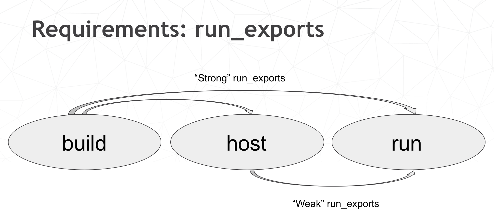

####################
The Joy of Packaging
####################

Scipy 2018 Tutorial
===================

Instructors
-----------

Michael Sarahan, Matt McCormick, Jean-Christophe Fillion-Robin, Filipe Fernandes Matt Craig, Chris Barker, Ray Donnelly, Jonathan Helmus

Outline
-------

Python Package

Installing

PyPi

Conda

Compatibility and automation

What is a “package”?
--------------------

In a broad sense, anything you install using your package manager

some kinds of packages have implied behavior and requirements

Unfortunate overloading: python “package”: a folder that python imports

Package Managers and Repos
--------------------------

NPM, apt, yum, dnf, chocolatey, pip, conda, homebrew, etc.

PyPI, anaconda.org, CRAN, CPAN

Some form of dependency management

Artifact and/or source repository

Implicit behavior & Requirements
--------------------------------

* Folder structure

* Directly usable, or must be unpacked/installed?

Python packages
---------------

::

  sound/
      __init__.py
  formats/
      __init__.py
      wavwrite.py
  effects/
      __init__.py
      echo.py

Folders must have ``__init__.py`` file to make Python able to import them

``__init__.py`` can be empty (and is, most of the time)

Python packages - why?
----------------------

import nested module

.. code-block:: python

	import sound.effects.echo

	from sound.effects import echo

.. code-block:: python

    from sound.effects.echo import somefunc

``https://docs.python.org/3/tutorial/modules.html#packages``

Let’s Make a Package
--------------------

::

    mypkg/
        __init__.py
        subpkg/
            __init__.py
            a.py

.. nextslide::

**Windows:**

.. code-block:: bash

	mkdir mypkg/subpkg

	echo. > mypkg/__init__.py

	echo . > mypkg/subpkg/__init__.py

	echo . > mypkg/subpkg/a.py

**Mac/Linux:**

.. code-block:: bash

	mkdir -p mypkg/subpkg

	touch mypkg/__init__.py

	touch mypkg/subpkg/__init__.py

	touch mypkg/subpkg/a.py

How Python Finds Packages
-------------------------

* In python interpreter:

  .. code-block:: python

  	import sys
  	from pprint import pprint
  	pprint(sys.path)

* ``sys.path`` explanation:

  ``https://stackoverflow.com/a/38403654/1170370``

How to Get Things on ``sys.path``
---------------------------------

* ``PYTHONPATH`` environment variable (fragile)

* Installing packages (destination: site-packages folder)

* ``.pth`` files in ``sys.path`` locations

Find your site-packages folder
------------------------------

* Windows:
  ``(install root)\Lib\site-packages``

* Mac/Linux:
  ``(install root)/lib/pythonX.Y/site-packages``

Installing packages
===================

Installing:

.. code-block:: bash

	python setup.py install

	pip install .

Development installs:

.. code-block:: bash

    python setup.py develop

    pip install -e .

+--------------------------------------+----------------------------------------+
| Install                              | Development Install                    |
+======================================+========================================+
| Copies package into site-packages    | Adds a ``.pth`` file to site-packages, |
|                                      | pointed at package source root         |
+--------------------------------------+----------------------------------------+
| Used when creating conda packages    | Used when developing software locally  |
+--------------------------------------+----------------------------------------+
| Normal priority in sys.path          | End of ``sys.path`` (only found if     |
|                                      | nothing else comes first)              |
+======================================+========================================+

https://grahamwideman.wikispaces.com/Python-+site-package+dirs+and+.pth+files

What about setup.py?
--------------------

.. code-block:: python

	#!/usr/bin/env

	pythonfrom setuptools import setups

	setup(name='Distutils',
	      version='1.0',
	      description='Python Distribution Utilities',
	      author='Greg Ward',
	      author_email='gward@python.net',
	      url='https://www.python.org/sigs/distutils-sig/',      packages=['distutils', 'distutils.command'],
	      )

``https://docs.python.org/2/distutils/setupscript.html``

What Does ``setup.py`` Do?
--------------------------

* Version & package metadata

* List of packages to include

* List of other files to include

* Lists of dependencies

* Lists of extensions to be compiled

Let’s Write a ``setup.py``
--------------------------

.. code-block:: python

    #!/usr/bin/env python

    from setuptools import setup

    setup(name='mypkg',
          version='1.0',
          # list folders, not files
          packages=['mypkg', 'mypkg.subpkg'],
          )

(remember that a "package" is a folder with a ``__init__.py__`` file)

setuptools
----------

* Separate library (ships with Python by default, though)

* Adds entry point capability

* Provides find_packages function (use with caution)

* Creates eggs by default (people spend time fighting this later in the process)

Where does setup.py go?
-----------------------

+--------------------------+-----------------------------------------------------+
|  Folder Structure        |                                                     |
+==========================+=====================================================+
|  .. code-block:: python  |                                                     |
|                          | * New outer folder                                  |
|    mypkg-src             | * ``setup.py`` alongside package to be installed    |
|    setup.py              | * ``mypkg`` is what will get installed              |
|    mypkg/                | * ``mypkg-src`` is what gets linked to by develop   |
|        __init__.py       |                                                     |
|        subpkg/           |                                                     |
|            __init__.py   |                                                     |
|            a.py          |                                                     |
+--------------------------+-----------------------------------------------------+

Try installing your package
---------------------------

.. code-block:: bash

	cd mypkg-src

	python setup.py install

	python -c “import mypkg.subpkg.a”

Go look in your ``site-packages`` folder

Making Packages the Easy Way
----------------------------

.. image:: images/cookiecutter.png

`github.com/audreyr/cookiecutter <https://github.com/audreyr/cookiecutter>`_

.. code-block:: bash

    conda install -c conda-forge cookiecutter

or

.. code-block:: bash

    pip install  cookiecutter

Let’s make a project
--------------------

cookiecutter: ``https://goo.gl/Jge1g8``

That’s a shortened link to:

``https://github.com/conda/cookiecutter-conda-python``

::

    full_name [Full Name]: Mike Sarahan
    email [Email Address]: msarahan@anaconda.com
    github_username [github_username]: msarahan
    repo_name [repository_name]: acon_demo
    package_name [acon_demo]:
    project_short_description [Short description]: acon demo
    version [0.1.0]:

What did we get?
----------------

.. code-block:: bash

    ls -R acon_demo

    README.rst   acon_demo  conda.recipe setup.py   tests
    acon_demo/acon_demo:
    __init__.py __main__.py cli.py
    acon_demo/conda.recipe:
    meta.yaml
    acon_demo/tests:
    __init__.py test_cli.py

Requirements in ``setup.py``
----------------------------

.. code-block:: python

    #!/usr/bin/env python
    from distutils.core import setup

    setup(name='mypkg',
          version='1.0',
          # list folders, not files
          packages=['mypkg', 'mypkg.subpkg'],
          install_requires=['click'],
          )

Requirements in ``requirements.txt``
------------------------------------

**Common Mistake:**

* ``requirements.txt`` often from pip freeze

* Pinned way too tightly.  OK for env creation, bad for packaging.
|
* Donald Stufft (PyPA): `Abstract vs. Concrete dependencies <https://caremad.io/posts/2013/07/setup-vs-requirement>`_

Requirements in ``setup.cfg`` (ideal)
-------------------------------------

::

    [metadata]
    name = my_package
    version = attr:
    src.VERSION

    [options]
    packages = find:
    install_requires =  click

Parseable without execution, unlike setup.py

`configuring setup using setup cfg files <http://setuptools.readthedocs.io/en/latest/setuptools.html#configuring-setup-using-setup-cfg-files>`_

Break time!
-----------

Up next: producing redistributable artifacts

Redistributable artifacts
=========================

* sdists

* wheels

* conda packages

* eggs (deprecated)

When/how to use an sdist
------------------------

* Pure python (no compilation requirements)

* Or, distributing source code that must be compiled prior to usage

.. code-block:: bash

    python setup.py sdist

Wheels vs. Conda packages
-------------------------

+-------------------------------------+-------------------------------------+
|  Wheels                             |    Conda packages                   |
+=====================================+=====================================+
| Employed by pip, blessed by PyPA    |  Foundation of Anaconda ecosystem   |
+-------------------------------------+-------------------------------------+
| Used by any python installation     |  Used by conda python installations |
+-------------------------------------+-------------------------------------+
| Mostly specific to Python ecosystem |  General purpose (any ecosystem)    |
+-------------------------------------+-------------------------------------+
| Good mechanism for specifying range |  Primitive support for multiple     |
| of python compatibility             |  python versions (noarch)           |
+-------------------------------------+-------------------------------------+
| Depends on static linking or other  | Can bundle core system-level shared |
| system package managers to provide  | libraries as packages, and resolve  |
| core libraries                      | dependencies                        |
+-------------------------------------+-------------------------------------+

Introducing conda-build
-----------------------

* Orchestrates environment creation, activation, and build/test processes

* Can build conda packages and/or wheels

* Separate project from conda, but very tightly integrated

* Open-source, actively developed:

  https://github.com/conda/conda-build

Getting ``conda-build`` to work for you
---------------------------------------

Input: ``meta.yaml`` files

.. code-block:: yaml

	package:
	  name: mypkg
	  version: 1.0

Let’s Use ``conda-build``
-------------------------

.. code-block:: bash

	conda install conda-build

* Windows only:

  ::

    conda install m2-patch posix

* All platforms:

.. code-block:: bash

	conda build mypkg-src

What happened?
--------------

* Templates filled in, recipe interpreted

* Build environment created (isolated)

* Build script run

* New files in build environment bundled into package

* Test environment created (isolated)

* Tests run on new package

* cleanup

Obtaining recipes
------------------

* Existing recipes (best)

   - https://github.com/AnacondaRecipes

   - https://github.com/conda-forge

* Skeletons from other repositories (PyPI, CRAN, CPAN, RPM)

|

* DIY

Anaconda Recipes
----------------

* Official recipes that Anaconda uses for building packages

* Since Anaconda 5.0, forked from conda-forge recipes.

* Intended to be compatible with conda-forge long-term

* Presently, ahead of conda-forge on use of conda-build 3 features

Conda-forge
-----------

.. image:: images/conda-forge.png

* Numfocus-affiliated community organization made up of volunteers

* One github repository per recipe

  - Fine granularity over permissions

* Heavy use of automation for building, deploying, and updating recipes

* Free builds on public CI services (TravisCI, CircleCI, Appveyor)

Skeletons
---------

* Read metadata from upstream repository

* Translate that into a recipe
|
* **Will** save you some boilerplate work

* **Might** work out of the box (should not assume automatic, though)

conda skeleton pypi
-------------------

.. code-block:: bash

	conda skeleton pypi <package name on pypi>

	conda skeleton pypi click

	conda skeleton pypi --recursive pyinstrument

conda skeleton cran
-------------------

.. code-block:: bash

	conda skeleton cran <name of pkg on cran>

	conda skeleton cran acs

	conda skeleton cran --recursive biwt

When all else fails, write a recipe
-----------------------------------

Only required section:

.. code-block:: yaml

	package:
	  name: abc
	  version: 1.2.3

Source types
------------

* url

* git

* hg

* svn

* local path

`meta.yaml source section <https://conda.io/docs/user-guide/tasks/build-packages/define-metadata.html#source-section>`_

Source Patches
--------------

* patch files live alongside meta.yaml

* create patches with:
  - ``diff``
  - ``git diff``
  - ``git format-patch``

`meta.yaml source section <https://conda.io/docs/user-guide/tasks/build-packages/define-metadata.html#source-section>`_

Exercise: let’s make a patch
----------------------------

.. code-block:: yaml

	package:
	  name: test-patch
	  version: 1.2.3

	source:
	  url: https://zlib.net/zlib-1.2.11.tar.gz

	build:
	  script: exit 1

.. nextslide::

* Builds that fail leave their build folders in place

* look in output for source tree in:

  ``*/conda-bld/test-patch_<numbers>/work``

* ``cd`` there

.. nextslide::

.. code-block:: bash

	git init

	git add *

	git commit -am “init”

	edit file of choice

	git commit -m “changing file because …”

	git format-patch HEAD~1

.. nextslide::

* copy that patch back alongside meta.yaml

* modify meta.yaml to include the patch

Multiple sources
----------------

.. code-block:: yaml

	source:
	  - url: https://package1.com/a.tar.bz2
	    folder: stuff
	  - url: https://package1.com/b.tar.bz2
	    folder: stuff
	    patches:
	      - something.patch
	  - git_url: https://github.com/conda/conda-build
	    folder: conda-build

`meta.yaml source section <https://conda.io/docs/user-guide/tasks/build-packages/define-metadata.html#source-section>`_

Build options
-------------

``number``:
  version reference of recipe (as opposed to version of source code)

``script``:
  quick build steps, avoid separate build.sh/bld.bat files

``skip``:
  skip building recipe on some platforms

``entry_points``:
  python code locations to create executables for

``run_exports``:
  add dependencies to downstream consumers to ensure compatibility

`meta.yaml build section <https://conda.io/docs/user-guide/tasks/build-packages/define-metadata.html#build-section>`_

Requirements
------------

.. image:: images/build_host_run.png

Requirements: build vs. host
----------------------------

Historically, only build

Still fine to use only build

host introduced for cross compiling

host also useful for separating build tools from packaging environment

.. nextslide::

If in doubt, put everything in host

build is treated same as host for old-style recipes
(only build, no {{ compiler() }})

packages are bundled from host env, not build env

Post-build tests
----------------

Help ensure that you didn’t make a packaging mistake

Ideally checks that necessary shared libraries are included as dependencies

Post-build tests: dependencies
------------------------------

Describe dependencies that are required for the tests
(but not for normal package usage)

.. code-block:: yaml

	test:
	  requires:
	    - pytest

Post-build tests: test files
----------------------------

::

  run_test.pl, run_test.py, run_test.r, run_test.lua

Windows::

  run_test.bat

Linux/Mac::

  run_test.sh

Post-build tests
----------------

May have specific requirements

May specify files that must be bundled for tests (source_files)

imports:
  language specific imports to try, to verify correct installation

commands:
  sequential shell-based commands to run (not OS-specific)

https://conda.io/docs/user-guide/tasks/build-packages/define-metadata.html#test-section

Import Tests
------------

.. code-block:: yaml

	test:

	  imports:

		- dateutil

		- dateutil.rrule

		- dateutil.parser

		- dateutil.tz

Test commands
-------------

.. code-block:: yaml

test:
  commands:
      - curl --version
      - curl-config --features  # [not win]
      - curl-config --protocols  # [not win]
      - curl https://some.website.com

Outputs - more than one pkg per recipe
--------------------------------------

.. code-block:: yaml

	package:
	  name: some-split
	  version: 1.0

	outputs:
	  - name: subpkg

	  - name: subpkg2

.. nextslide::

* Useful for consolidating related recipes that share (large) source

* Reduce update burden

* Reduce build time by keeping some parts of the build, while looping over other parts

* Also output different types of packages from one recipe (wheels)

https://conda.io/docs/user-guide/tasks/build-packages/define-metadata.html#outputs-section

Outputs rules
-------------

* list of dicts

* each list must have name or type key

* May use all entries from build, requirements, test, about sections

* May specify files to bundle either using globs or by running a script

Outputs examples
----------------

https://github.com/AnacondaRecipes/curl-feedstock/blob/master/recipe/meta.yaml

https://github.com/AnacondaRecipes/aggregate/blob/master/ctng-compilers-activation-feedstock/recipe/meta.yaml

Exercise: split a package
-------------------------

Curl is a library and an executable.  Splitting them lets us clarify where Curl is only a build time dependency, and where it also needs to be a runtime dependency.

Starting point:

https://github.com/conda-forge/curl-feedstock/tree/master/recipe

.. nextslide::

Solution:

https://github.com/AnacondaRecipes/curl-feedstock/tree/master/recipe

About section
-------------

.. image:: images/about_section.png

Extra section: free-for-all
---------------------------

* Used for external tools or state management

* No schema

* Conda-forge’s maintainer list

* Conda-build’s notion of whether a recipe is “final”

https://conda.io/docs/user-guide/tasks/build-packages/define-metadata.html#extra-section

Break time!
-----------

Advanced recipe tricks coming next

Conditional lines (selectors)
-----------------------------

::

  some_content    # [some expression]

content inside ``[...]`` is eval’ed

namespace includes OS info, python info, and a few others

https://conda.io/docs/user-guide/tasks/build-packages/define-metadata.html#preprocessing-selectors

Exercise: limit a recipe to only Linux
--------------------------------------

.. code-block:: yaml

	package:
	  name: example_skip_recipe
	  version: 1.0

	  build:
	  skip: True

.. nextslide::

.. code-block:: yaml

	package:
	  name: example_skip_recipe
	  version: 1.0

	  build:
	  skip: True# [not linux]

Intro to templating with Jinja2
--------------------------------

* Fill in information dynamically

	- git tag info

	- setup.py recipe data

	- centralized version numbering

	- string manipulation

How does templating save you time?
----------------------------------

.. code-block:: yaml

	

	package:
	  name: example
	  version: {{ version }}
	source:
	  url: https://site/{{version}}.tgz

Jinja2 templating in meta.yaml
------------------------------

Set variables::

  

Use variables::

  {{ somevar }}

Expressions in ``{{ }}`` are roughly python

Jinja2 conditionals
-------------------

Selectors are one line only.  When you want to toggle a block,
use jinja2::

  

  toggled content

  on many lines

  

Exercise: use Jinja2 to reduce edits
------------------------------------

.. code-block:: yaml

	package:

	  name: abc

	  version: 1.2.3

	source:

	  url: http://my.web/abc-1.2.3.tgz

Variants: Jinja2 on steroids
----------------------------

Matrix specification in yaml files

.. code-block:: yaml

	somevar:

	  - 1.0

	  - 2.0

	anothervar:

	  - 1.0

All variant variables exposed in jinja2
---------------------------------------

In meta.yaml,

``{{ somevar }}``

And this loops over values

Exercise: try looping
---------------------

meta.yaml:

.. code-block:: yaml

	package:
	  name: abc
	  version: 1.2.3

	build:
	  skip: True # [skipvar]

conda_build_config.yaml:

.. code-block:: yaml

	skipvar:
			- True
	- False

.. nextslide::

meta.yaml:

.. code-block:: yaml

	package:

	  name: abc

	  version: 1.2.3

	requirements:

	  build:

	    - python {{ python }}

	  run:

	    - python {{ python }}

conda_build_config.yaml:

.. code-block:: yaml

	python:

			- 2.7

	- 3.6

.. nextslide::

meta.yaml:

.. code-block:: yaml

	package:

	  name: abc

	  version: 1.2.3

	requirements:

	  build:

	    - python

	  run:

	    - python

.. nextslide::

conda_build_config.yaml:

.. code-block:: yaml

	python:

			- 2.7

	- 3.6

Jinja2 functions
----------------

loading source data:

	``load_setup_py_data``

	``load_file_regex``

Dynamic Pinning:

	``pin_compatible``

	``pin_subpackage``

Compatibility Control:

	``compiler``

	``cdt``

Loading setup.py data
---------------------

.. code-block:: yaml

	

	package:
	  name: abc
	  version: {{ setup_data[‘version’] }}

* Primarily a development recipe tool - release recipes specify version instead, and template source download link

* Centralizing version info is very nice - see also versioneer, setuptools_scm, autover, and many other auto-version tools

Loading arbitrary data
----------------------

.. code-block:: yaml

	

	package:
	  name: conda-build-test-get-regex-data
	  version: {{ data.group(1) }}

* Useful when software provides version in some arbitrary file

* Primarily a development recipe tool - release recipes specify version instead, and template source download link

Dynamic pinning
---------------

Use in meta.yaml, generally in requirements section:

.. code-block:: yaml

	requirements:

	  host:

	    - numpy

	  run:

	    - {{ pin_compatible(‘numpy’) }}

.. nextslide::

Use in meta.yaml, generally in requirements section:

.. code-block:: yaml

	requirements:
	  host:
	    - numpy
	  run:
	    - {{ pin_compatible(‘numpy’) }}

* Pin run req based on what is present at build time

Dynamic pinning in practice
---------------------------

Used a lot with numpy:

https://github.com/AnacondaRecipes/scikit-image-feedstock/blob/master/recipe/meta.yaml

Dynamic pinning within recipes
------------------------------

Refer to other outputs within the same recipe

 - When intradependencies exist

 - When shared libraries are consumed by other libraries

https://github.com/AnacondaRecipes/aggregate/blob/master/clang/meta.yaml

Compilers
---------

Use in meta.yaml in requirements section:

.. code-block:: yaml

     requirements:
         build:
             - {{ compiler(‘c’) }}

* explicitly declare language needs

* compiler packages can be actual compilers, or just activation scripts

* Compiler packages utilize run_exports to add necessary runtime dependencies automatically

``run_exports``
---------------

“if you build and link against library abc, you need a runtime dependency on library abc”

This is annoying to keep track of in recipes.

Upstream package “abc” (already built)

.. code-block:: yaml

	package:
	  name: abc
	  version: 1.0

	build:
	  run_exports:
	    - abc 1.0.*

Downstream recipe

.. code-block:: yaml

	requirements:
	  host:
	    - abc

Downstream package

.. code-block:: yaml

	requirements:
	  host:
	    - abc 1.0 0
	  run:
	    - abc 1.0.*

.. nextslide::

.. image:: images/run_exports.png

.. nextslide::

* Add host or run dependencies for downstream packages that depend on upstream that specifies run_exports

* Expresses idea that “if you build and link against library abc, you need a runtime dependency on library abc”

* Simplifies version tracking

Requirements: run_exports
-------------------------

Uploading packages: anaconda.org
--------------------------------

* Sign-up:

  - ``https://anaconda.org/``

* Requirement:

  - ``conda install anaconda-client``

* CLI: anaconda upload path-to-package

* conda-build auto-upload:

  - ``conda config --set anaconda_upload True``

Uploading packages: PyPI
------------------------

* Sign-up: ``https://pypi.org/account/register/``

* Twine: ``pip install twine``

* Upload with twine to Test PyPI:

  - ``twine upload --repository-url https://test.pypi.org/legacy/ dist/*

* Upload to PyPI: ``twine upload dist/*``

Anaconda Survey
---------------

https://www.surveymonkey.com/r/conda

Install

Development install

Copies package into site-packages

Adds a .pth file to site-packages, pointed at package source root

Used when creating conda packages

Used when developing software locally

Normal priority in sys.path

End of sys.path (only found if nothing else comes first)

https://grahamwideman.wikispaces.com/Python-+site-package+dirs+and+.pth+files

What about setup.py?

#!/usr/bin/env pythonfrom setuptools import setupsetup(name='Distutils',      version='1.0',      description='Python Distribution Utilities',      author='Greg Ward',      author_email='gward@python.net',      url='https://www.python.org/sigs/distutils-sig/',      packages=['distutils', 'distutils.command'],     )

https://docs.python.org/2/distutils/setupscript.html

Lists of extensions to be compiled
----------------------------------
What does setup.py do?

Version & package metadata

List of packages to include

List of other files to include

Lists of dependencies

#!/usr/bin/env pythonfrom setuptools import setupsetup(name='mypkg',      version='1.0',      # list folders, not files      packages=['mypkg', 'mypkg.subpkg'],     )
------------------------------------------------------------------------------------------------------------------------------------------------------------------------------
Let’s write setup.py

creates eggs by default (people spend time fighting this later in the process)
------------------------------------------------------------------------------
Setuptools

Separate library (ships with Python by default, though)

Adds entry point capability

provides find_packages function (use with caution)

mypkg/    __init__.py    subpkg/        __init__.py        a.py
-------------------------------------------------------------------
Where does setup.py go?

mypkg-src

setup.py

New outer folder

setup.py alongside package to be installed

mypkg is what will get installed

mypkg-src is what gets linked to by develop

Go look in your site-packages folder
------------------------------------
Try installing your package

cd mypkg-src

python setup.py install

python -c “import mypkg.subpkg.a”

Making packages the easy way

https://github.com/audreyr/cookiecutter

conda install -c conda-forge cookiecutter

https://github.com/conda/cookiecutter-conda-python
--------------------------------------------------
Let’s make a project

cookiecutter https://goo.gl/Jge1g8

That’s a shortened link to:

What did we get?
----------------

install_requires=['click'],     )
----------------------------------
Adding requirements in setup.py

#!/usr/bin/env pythonfrom distutils.core import setupsetup(name='mypkg',      version='1.0',      # list folders, not files      packages=['mypkg', 'mypkg.subpkg'],

Donald Stufft (PyPA): Abstract vs. Concrete dependencies
--------------------------------------------------------
Requirements in requirements.txt

common mistake

requirements.txt often from pip freeze

Pinned way too tightly.  OK for env creation, bad for packaging.

https://caremad.io/posts/2013/07/setup-vs-requirement/

Requirements in setup.cfg (ideal)

[metadata]name = my_packageversion = attr: src.VERSION[options]packages = find:install_requires =  click

http://setuptools.readthedocs.io/en/latest/setuptools.html#configuring-setup-using-setup-cfg-files

Parseable without execution, unlike setup.py

Up next: producing redistributable artifacts
--------------------------------------------
Break time!

eggs (deprecated)
-----------------
Redistributable artifacts

sdists

wheels

conda packages

python setup.py sdist
---------------------
When/how to use an sdist

Pure python (no build requirements)

Wheels vs. Conda packages
-------------------------

Wheels

Conda packages

Employed by pip, blessed by PyPA

Foundation of Anaconda ecosystem

Used by any python installation

Used by conda python installations

Mostly specific to Python ecosystem

 General purpose (any ecosystem)

Good mechanism for specifying range of python compatibility

 Primitive support for multiple python

     versions (noarch)

Depends on static linking or other system package managers to provide core libraries

Can bundle core system-level shared libraries as packages, and resolve dependencies

Open-source, actively developedhttps://github.com/conda/conda-build
--------------------------------------------------------------------
Introducing conda-build

Orchestrates environment creation, activation, and build/test processes

Can build conda packages and/or wheels

Separate project from conda, but very tightly integrated

version: 1.0
------------
Getting conda-build to work for you

Input: meta.yaml files

package:

  name: mypkg

conda build mypkg-src
---------------------
Let’s use conda-build

conda install conda-build

cleanup
-------
What happened?

templates filled in, recipe interpreted

build environment created (isolated)

build script run

new files in build environment bundled into package

test environment created (isolated)

tests run on new package

DIY
---
Obtaining recipes

Existing recipes (best)

https://github.com/AnacondaRecipes

https://github.com/conda-forge

Skeletons from other repositories (PyPI, CRAN, CPAN, RPM)

Presently, ahead of conda-forge on use of conda-build 3 features
----------------------------------------------------------------
AnacondaRecipes

Official recipes that Anaconda uses for building packages

Since Anaconda 5.0, forked from conda-forge recipes.

Intended to be compatible with conda-forge long-term

Free builds on public CI services (TravisCI, CircleCI, Appveyor)
----------------------------------------------------------------
Conda-forge

Numfocus-affiliated community organization made up of volunteers

One github repository per recipe

Fine granularity over permissions

Heavy use of automation for building, deploying, and updating recipes

Might work out of the box (should not assume automatic, though)
---------------------------------------------------------------
Skeletons

Read metadata from upstream repository

Translate that into a recipe

Will save you some boilerplate work

conda skeleton pypi --recursive pyinstrument
--------------------------------------------
conda skeleton pypi

conda skeleton pypi <package name on pypi>

conda skeleton pypi click

conda skeleton cran --recursive biwt
------------------------------------
conda skeleton cran

conda skeleton cran <name of pkg on cran>

conda skeleton cran acs

version: 1.2.3
--------------
When all else fails, write a recipe

Only required section:

package:

  name: abc

local path
----------
Source types

url

git

hg

svn

https://conda.io/docs/user-guide/tasks/build-packages/define-metadata.html#source-section

create patches with diff, git diff, or git format-patch
-------------------------------------------------------
Source patches

patch files live alongside meta.yaml

https://conda.io/docs/user-guide/tasks/build-packages/define-metadata.html#source-section

Exercise: let’s make a patch
----------------------------
package:

  name: test-patch

  version: 1.2.3

source:

  url: https://zlib.net/zlib-1.2.11.tar.gz

build:

  script: exit 1

https://conda.io/docs/user-guide/tasks/build-packages/define-metadata.html#source-section

Exercise: let’s make a patch
----------------------------

Builds that fail leave their build folders in place

look in output for source tree in: ``*/conda-bld/test-patch_<numbers>/work``

``cd there``

Exercise: let’s make a patch
----------------------------

.. code-block:: bash

	git init

	git add *

	git commit -am “init”

	edit file of choice

	git commit -m “changing file because …”

	git format-patch HEAD~1

.. nextslide::

copy that patch back alongside ``meta.yaml``

modify meta.yaml to include the patch

Multiple sources
----------------

.. code-block:: yaml

source:
  - url: https://package1.com/a.tar.bz2
    folder: stuff
  - url: https://package1.com/b.tar.bz2
    folder: stuff
    patches:
       - something.patch
  - git_url:  https://github.com/conda/conda-build
    folder:  conda-build

https://conda.io/docs/user-guide/tasks/build-packages/define-metadata.html#source-section

Build options
-------------

number:
  version reference of recipe (as opposed to version of source code)

script:
  quick build steps, avoid separate build.sh/bld.bat files

skip:
  skip building recipe on some platforms

entry_points:
  python code locations to create executables for

run_exports:
  add dependencies to downstream consumers to ensure compatibility

https://conda.io/docs/user-guide/tasks/build-packages/define-metadata.html#build-section

Requirements
------------

build

host

run

host also useful for separating build tools from packaging environment
----------------------------------------------------------------------

Requirements: build vs. host

Historically, only build

Still fine to use only build

host introduced for cross compiling

packages are bundled from host env, not build env
-------------------------------------------------

Requirements: build vs. host

If in doubt, put everything in host

build is treated same as host for old-style recipes
(only build, no ``{{ compiler() }}``)

Post-build tests
----------------

Help ensure that you didn’t make a packaging mistake

Ideally checks that necessary shared libraries are included as dependencies

--------
Post-build tests: dependencies
------------------------------

Describe dependencies that are required for the tests (but not for normal package usage)

.. code-block:: yaml

	test:

	  requires:

    	- pytest

Post-build tests: test files
----------------------------

::

  run_test.pl, run_test.py, run_test.r, run_test.lua

Windows::

  run_test.bat

Linux/Mac::

  run_test.sh

Post-build tests
----------------

May have specific requirements

May specify files that must be bundled for tests (source_files)

imports:
  language specific imports to try, to verify correct installation

commands:
  sequential shell-based commands to run (not OS-specific)

https://conda.io/docs/user-guide/tasks/build-packages/define-metadata.html#test-section

Import tests
------------

.. code-block:: yaml

	test:
	  imports:
		- dateutil
		- dateutil.rrule
		- dateutil.parser
	    - dateutil.tz

Test commands
-------------

.. code-block:: yaml

	test:
	  commands:
	      - curl --version
	      - curl-config --features  # [not win]
	      - curl-config --protocols  # [not win]
	      - curl https://some.website.com

Outputs - more than one pkg per recipe
--------------------------------------

package:

  name: some-split  version: 1.0

outputs:

  - name: subpkg
  - name: subpkg2

subpkg

subpkg2

.. nextslide::

Useful for consolidating related recipes that share (large) source

Reduce update burden

Reduce build time by keeping some parts of the build, while looping over other parts

Also output different types of packages from one recipe (wheels)

https://conda.io/docs/user-guide/tasks/build-packages/define-metadata.html#outputs-section

Outputs rules
-------------

list of dicts

each list must have name or type key

May use all entries from build, requirements, test, about sections

May specify files to bundle either using globs or by running a script

https://conda.io/docs/user-guide/tasks/build-packages/define-metadata.html#outputs-section

https://github.com/AnacondaRecipes/aggregate/blob/master/ctng-compilers-activation-feedstock/recipe/meta.yaml

Outputs examples
----------------

https://github.com/AnacondaRecipes/curl-feedstock/blob/master/recipe/meta.yaml

https://github.com/conda-forge/curl-feedstock/tree/master/recipe

Exercise: split a package
-------------------------

Curl is a library and an executable.  Splitting them lets us clarify where Curl is only a build time dependency, and where it also needs to be a runtime dependency.

Starting point:

https://conda.io/docs/user-guide/tasks/build-packages/define-metadata.html#outputs-section

https://github.com/AnacondaRecipes/curl-feedstock/tree/master/recipe
--------------------------------------------------------------------
Exercise: split a package

Solution:

https://conda.io/docs/user-guide/tasks/build-packages/define-metadata.html#outputs-section

About section
-------------
https://conda.io/docs/user-guide/tasks/build-packages/define-metadata.html#about-section

Provide this stuff

Conda-build’s notion of whether a recipe is “final”
---------------------------------------------------
Extra section: free-for-all

Used for external tools or state management

No schema

Conda-forge’s maintainer list

https://conda.io/docs/user-guide/tasks/build-packages/define-metadata.html#extra-section

Advanced recipe tricks coming next
----------------------------------
Break time!

namespace includes OS info, python info, and a few others
---------------------------------------------------------
Conditional lines (selectors)

some_content    # [some expression]

content inside [] is eval’ed

https://conda.io/docs/user-guide/tasks/build-packages/define-metadata.html#preprocessing-selectors

Exercise: limit a recipe to only Linux
--------------------------------------

https://conda.io/docs/user-guide/tasks/build-packages/define-metadata.html#preprocessing-selectors

Intro to templating with Jinja2

Fill in information dynamically

git tag info

setup.py recipe data

centralized version numbering

string manipulation

Expressions in {{ }} are roughly python
---------------------------------------
Jinja2 templating in meta.yaml

Set variables:



Use variables:

{{ somevar }}

Jinja2 conditionals

Selectors are one line only.  When you want to toggle a block, use jinja2:



toggled content

on many lines



url: http://my.web/abc-1.2.3.tgz
--------------------------------
Exercise: use Jinja2 to reduce edits

package:

  name: abc

  version: 1.2.3

source:

- 1.0
-----
Variants: Jinja2 on steroids

Matrix specification in yaml files

somevar:

  - 1.0

  - 2.0

anothervar:

And this loops over values
--------------------------
All variant variables exposed in jinja2

In meta.yaml,

{{ somevar }}

skip: True # [skipvar]
----------------------
Exercise: try looping

meta.yaml:

package:

  name: abc

  version: 1.2.3

build:

conda_build_config.yaml:

skipvar:

		- True

- False

- python {{ python }}
---------------------
Exercise: try looping

meta.yaml:

package:

  name: abc

  version: 1.2.3

requirements:

  build:

    - python {{ python }}

  run:

conda_build_config.yaml:

python:

		- 2.7

- 3.6

- python
--------
Exercise: try looping

meta.yaml:

package:

  name: abc

  version: 1.2.3

requirements:

  build:

    - python

  run:

conda_build_config.yaml:

python:

		- 2.7

- 3.6

cdt
---
Jinja2 functions

load_setup_py_data

load_file_regex

pin_compatible

pin_subpackage

compiler

Dynamic pinning

Loading source data

Compatibility control

Loading setup.py data
---------------------



package:

  name: abc

  version: {{ setup_data[‘version’] }}

Primarily a development recipe tool - release recipes specify version instead, and template source download link

Centralizing version info is very nice - see also versioneer, setuptools_scm, autover, and many other auto-version tools

Primarily a development recipe tool - release recipes specify version instead, and template source download link
----------------------------------------------------------------------------------------------------------------
Loading arbitrary data



package:

  name: conda-build-test-get-regex-data

  version: {{ data.group(1) }}

Useful when software provides version in some arbitrary file

- {{ pin_compatible(‘numpy’) }}
-------------------------------
Dynamic pinning

Use in meta.yaml, generally in requirements section:

requirements:

  host:

    - numpy

  run:

- {{ pin_compatible(‘numpy’) }}
-------------------------------
Dynamic pinning

Use in meta.yaml, generally in requirements section:

requirements:

  host:

    - numpy

  run:

Pin run req based on what is present at build time

https://github.com/AnacondaRecipes/scikit-image-feedstock/blob/master/recipe/meta.yaml
--------------------------------------------------------------------------------------
Dynamic pinning in practice

Used a lot with numpy:

Dynamic pinning within recipes

Refer to other outputs within the same recipe

when intradependencies exist

when shared libraries are consumed by other libraries

https://github.com/AnacondaRecipes/aggregate/blob/master/clang/meta.yaml

Compiler packages utilize run_exports to add necessary runtime dependencies automatically
-----------------------------------------------------------------------------------------
Compilers

Use in meta.yaml in requirements section:

requirements:  build:    - {{ compiler(‘c’) }}

explicitly declare language needs

compiler packages can be actual compilers, or just activation scripts

run_exports
-----------

package:

  name: abc

  version: 1.0

build:

  run_exports:

    - abc 1.0.*

Upstream package “abc” (already built)

Downstream recipe

requirements:

  host:

    - abc

requirements:

  host:

    - abc 1.0 0

  run:

    - abc 1.0.*

Downstream package

Simplifies version tracking
---------------------------
run_exports

Add host or run dependencies for downstream packages that depend on upstream that specifies run_exports

expresses idea that “if you build and link against library abc, you need a runtime dependency on library abc”

Requirements: run_exports
-------------------------

build

host

run

“Strong” run_exports

“Weak” run_exports

Uploading packages: anaconda.org
--------------------------------

Uploading packages: PyPI
------------------------

https://www.surveymonkey.com/r/conda
------------------------------------
Anaconda Survey

