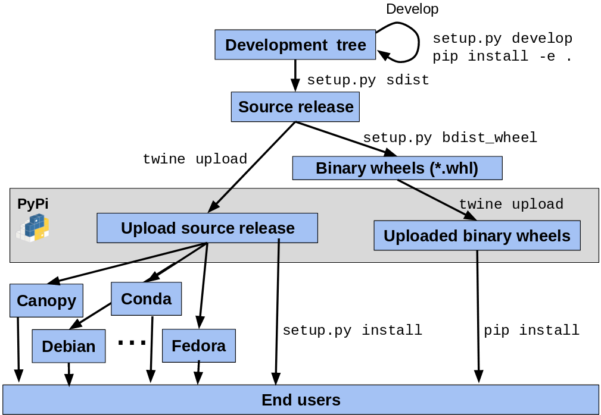

.. _uploading:

******************************
Building and Uploading to PyPi
******************************

Learning Objectives
===================

In the following section we will ...
------------------------------------

* Review the packaging terminology
* Understand how to build, package and publish a python package

Packaging Terminology 101
=========================

Introduction
------------

This section reviews the key python packaging concepts and definitions.

PyPI
----

PyPI is the default `Package Index <https://packaging.python.org/glossary/#term-package-index>`_ for the Python community.
It is open to all Python developers to consume and distribute their **distributions**.

There are two instances of the Package Index:

* PyPI: Python Package Index hosted at https://pypi.org/

* TestPyPI: a separate instance of the Python Package Index (PyPI) that allows you to try out the
  distribution tools and process without worrying about affecting the real index.
  TestPyPI is hosted at https://test.pypi.org

Reference: https://packaging.python.org/glossary/#term-python-package-index-pypi

pip
---

The `PyPA <https://www.pypa.io/en/latest/>`_ recommended tool for installing Python packages.

A multi-faceted tool:

* It is an *integration frontend* that takes a set of package requirements (e.g. a requirements.txt file)
  and attempts to update a working environment to satisfy those requirements. This may require locating,
  building, and installing a combination of **distributions**.

* It is a **build frontend** that can takes arbitrary source trees or source distributions and builds wheels
  from them.

Reference: http://pip.readthedocs.io/

PyPA
----

The Python Packaging Authority (PyPA) is a working group that maintains many of the relevant
projects in Python packaging.

The associated website https://www.pypa.io references the PyPA Goals, Specifications and Roadmap
as well as `Python Packaging User Guide <https://packaging.python.org/>`_, a collection of tutorials
and references to help you distribute and install Python packages with modern tools.

Reference: https://www.pypa.io

Source distribution
-------------------

* Synonyms: sdist, Source release

* provides metadata + source files

* needed for installing

  * by a tool like pip
  * or for generating a Built Distribution

Reference: https://packaging.python.org/glossary/#term-source-distribution-or-sdist

Built Distribution
------------------

* Synonyms: bdist

* provides metadata + pre-built files

* only need to be moved (usually by pip) to the correct locations on the target system

Reference: https://packaging.python.org/glossary/#term-built-distribution

Python Distribution: pure vs non-pure
-------------------------------------

* **pure**:

  * Not specific to a CPU architecture
  * No `ABI (Application Binary Interface) <https://en.wikipedia.org/wiki/Application_binary_interface>`_

* **non-pure**

  * `ABI <https://en.wikipedia.org/wiki/Application_binary_interface>`_
  * Platform specific

Reference: https://packaging.python.org/glossary/#term-module

Binary Distribution
-------------------

* is a **Built Distribution**
* is **non-pure**
* uses platform-specific compiled extensions

Reference: https://packaging.python.org/glossary/#term-binary-distribution

Wheel
-----

* a **Built Distribution**

* a ZIP-format archive with .whl extension

  * ``{distribution}-{version}(-{build tag})?-{python tag}-{abi tag}-{platform tag}.whl``

* described  by `PEP 427 <https://www.python.org/dev/peps/pep-0427/>`_

Reference: https://packaging.python.org/glossary/#term-wheel

Wheels vs. Conda packages
-------------------------

+-------------------------------------+-------------------------------------+
|  Wheels                             |    Conda packages                   |
+=====================================+=====================================+
| Employed by pip, blessed by PyPA    |  Foundation of Anaconda ecosystem   |
+-------------------------------------+-------------------------------------+
| Used by any python installation     |  Used by conda python installations |
+-------------------------------------+-------------------------------------+
| Mostly specific to Python ecosystem |  General purpose (any ecosystem)    |
+-------------------------------------+-------------------------------------+
| Good mechanism for specifying range |  Primitive support for multiple     |
| of python compatibility             |  python versions (noarch)           |
+-------------------------------------+-------------------------------------+
| Depends on static linking or other  | Can bundle core system-level shared |
| system package managers to provide  | libraries as packages, and resolve  |
| core libraries                      | dependencies                        |
+-------------------------------------+-------------------------------------+

.. note:: To learn more about Conda, see :ref:`conda-build` section.

Virtual Environment
-------------------

An isolated Python environment that allows packages to be installed for use by a
particular application, rather than being installed system wide.

Reference: https://packaging.python.org/glossary/#term-virtual-environment

Build system
------------

Synonym: Build backend

* `setuptools <https://setuptools.readthedocs.io>`_ associated with the `wheel <https://wheel.readthedocs.io>`_ package
  form the default build system. They support the creation of source and **built distributions** based on a ``setup.py`` and
  optionally a ``setup.cfg`` file.

* `flit <https://flit.readthedocs.io/en/latest/>`_ is an alternative backend allowing to also create (and also publish)
  **built distributions**.

Python Package Lifecycle
------------------------

Tutorial
========

Introduction
------------

This section discusses how to build python packages (or distributions) and publish
them in a central repository to streamline their installation. Finally, we conclude
with an exercise where we publish a package with the `Test Python Package Index <http://test.pypi.org/>`_.

Creating an environment
-----------------------

**To be done**

Learn more reading `Creating Virtual Environments <https://packaging.python.org/tutorials/installing-packages/#creating-and-using-virtual-environments>`_

Building a source distribution
------------------------------

Bu leveraging the ``setup.py`` script, setuptools can build a source
distribution (a tar archive of all the files needed to build and install the package):

.. code-block:: bash

    python setup.py sdist  # the sdist will be generated in the ./dist subdirectory

Installing a wheel
------------------

.. code-block:: bash

    pip install /path/to/package.whl

.. code-block:: bash

    pip install package  # this will download the package from PyPI

Building a wheel
----------------

.. code-block:: bash

    pip wheel . -w dist

Registering to PyPI
-------------------

**To be done**

Publishing to PyPI
------------------

**To be done**

An other approach: filt
-----------------------

**To be done**

Exercises
=========

Resources
=========

Where do I go to figure this out?
---------------------------------

This is a really good guide:

Python Packaging User Guide:

https://packaging.python.org/

and a more detailed tutorial:

http://python-packaging.readthedocs.io/en/latest/

**Follow one of them**

There is a sample project here:

https://github.com/pypa/sampleproject

(this has all the complexity you might need...)

You can use this as a template for your own packages.

Here is an opinionated update -- a little more fancy, but some good ideas:

https://blog.ionelmc.ro/2014/05/25/python-packaging/

Rather than doing it by hand, you can use the nifty "cookie cutter" project:

https://cookiecutter.readthedocs.io/en/latest/

And there are a few templates that can be used with that.

The core template written by the author:

https://github.com/audreyr/cookiecutter-pypackage

And one written by the author of the opinionated blog post above:

https://github.com/ionelmc/cookiecutter-pylibrary

Either are great starting points.

